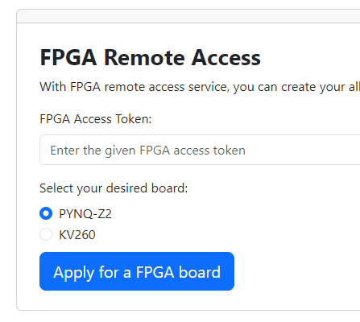

# FPGA Camp Remote Lab Guide

### Sign up

1. Sign up the remote lab with your **academic** e-mail

   [http://124.223.111.52:8996/home](http://124.223.111.52:8996/home)
2. Login on the website using your username and password

### Enter the Access Token

3. Enter the Access Token:
   * **This token will be expired in th 15th July**

### Apply for a PYNQ Remote Device

4. Click the Board link to and copy the password to lanuch the Jupyter Notebook. This may takes 15 seconds, please wait patiently.

   

### Note:

1. Don’t open several notebooks together and execute them all in parallel.
2. Please run the Python command line in each notebook one by one patiently.
3. Please stop the kernel and close all the notebooks before you leave the Jupyter Lab.
