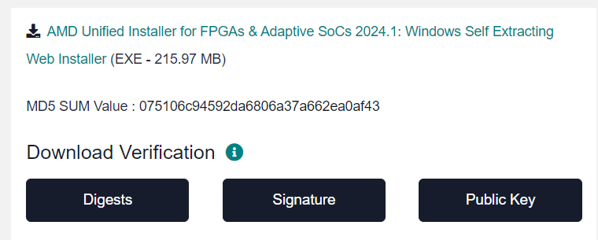
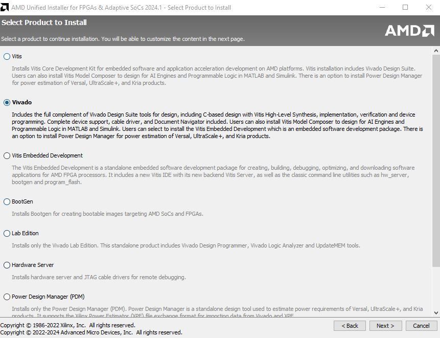
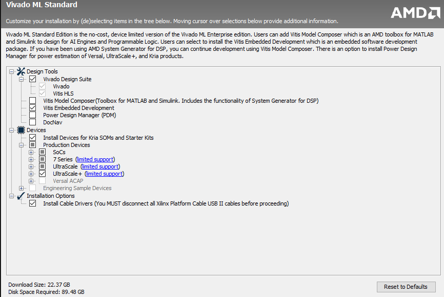
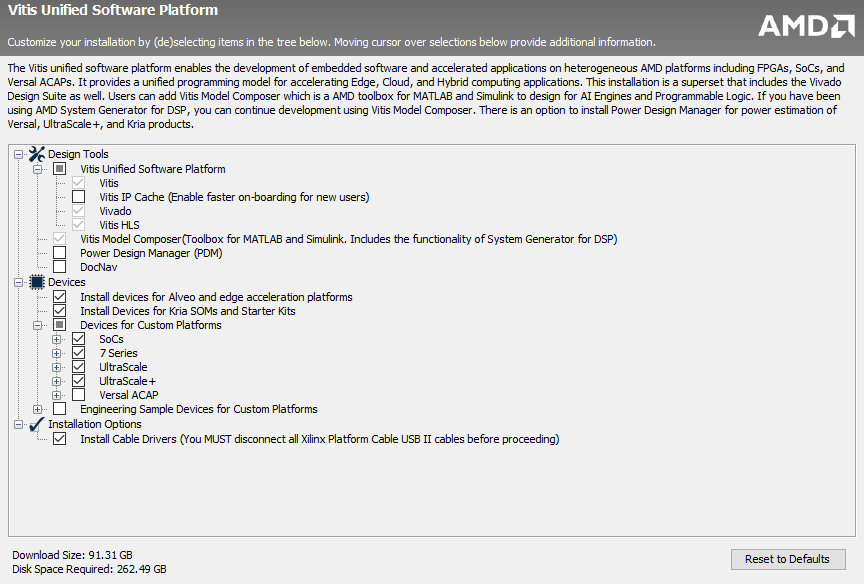

# **Tools Installation Guide**

## Vivado Tool

1. Visit download page: [https://www.xilinx.com/support/download/index.html/content/xilinx/en/downloadNav/vivado-design-tools.html]()
2. Downlad the Windows Self extracting web installer
   Note: Choose Linux Self extracting web installer if you are using Linux Machine
   
3. Verify the Supported OS on the welcome page
4. Click Next to verify the AMD account with e-mail address and password
5. Select Vivado and click next
   
6. Select Vivado ML standard and click next
7. Select the Vitis Embedded Development or Vitis Model Composer option based on your requirement and click next
   
8. Accept the license agreement and click next
9. Select the install dictionary with enough disk space and click next
10. Click install to finish the process of both downloading and installation

## Vitis Tool

1. Visit download page: [https://www.xilinx.com/support/download/index.html/content/xilinx/en/downloadNav/vitis.html]()
2. Downlad the Windows Self extracting web installer
   Note: Choose Linux Self extracting web installer if you are using Linux Machine
   
3. Verify the Supported OS on the welcome page
4. Click Next to verify the AMD account with e-mail address and password
5. Select Vitis and click next
6. Select the following options and click next
   
7. Accept the license agreement and click next
8. Select the install dictionary with enough disk space and click next
9. Click install to finish the process of both downloading and installation
